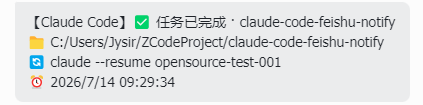

<div align="center">

# claude-code-feishu-notify

**Get Feishu/Lark notifications when Claude Code needs permission or finishes a task**

English · [简体中文](./README.md)

Zero dependencies · Single file · Cross-platform · Non-blocking · Interactive card



*An actual Feishu interactive card as received*

</div>

---

## ✨ What is this

When using Claude Code (or any client compatible with Claude Code hooks), you often miss the moment when:

- 🔔 Claude asks for **permission**, but you're looking at something else
- ✅ A long task **finishes**, while you keep staring at the terminal

This project uses Claude Code's **Hooks** to automatically push a Feishu group message at those key moments — so you can walk away and come back when your phone buzzes.

A notification looks like:

```
【Claude Code】🔔 Permission needed · my-project
📁 C:/Users/me/projects/my-project
🔄 claude --resume ca330f41-5c35-495c-97ac-0e2d42a70b82
⏰ 2026/7/14 09:19:07
```

The `🔄 claude --resume <id>` line can be **copied straight into your terminal** to jump back into that session.

## 🚀 Quick start

### Prerequisites

- [Claude Code](https://docs.claude.com/en/docs/claude-code/overview) (or a hooks-compatible client)
- **Node.js** v16+

### Three steps

**1. Create a Feishu bot** — In a Feishu group: Settings → Group Bots → Add Bot → **Custom Bot**. Copy the webhook URL:
```
https://open.feishu.cn/open-apis/bot/v2/hook/<your-key>
```

**2. Place the script** — Copy `hooks/feishu-notify.js` to a stable location, e.g. `~/.claude/hooks/feishu-notify.js`.

**3. Configure Claude Code** — Edit `~/.claude/settings.json`:

```jsonc
{
  "env": {
    "FEISHU_WEBHOOK": "https://open.feishu.cn/open-apis/bot/v2/hook/your-key"
  },
  "hooks": {
    "Notification": [
      { "hooks": [ { "type": "command", "command": "node \"/home/you/.claude/hooks/feishu-notify.js\"" } ] }
    ],
    "Stop": [
      { "hooks": [ { "type": "command", "command": "node \"/home/you/.claude/hooks/feishu-notify.js\"" } ] }
    ],
    "SubagentStop": [
      { "hooks": [ { "type": "command", "command": "node \"/home/you/.claude/hooks/feishu-notify.js\"" } ] }
    ]
  }
}
```

**Restart Claude Code.** Done. 🎉

> Full copy-paste example: [`examples/settings.example.json`](./examples/settings.example.json)

## 🧪 Test it

```bash
echo '{"hook_event_name":"Stop","cwd":"/home/me/my-project","session_id":"test-123"}' \
  | FEISHU_WEBHOOK="https://open.feishu.cn/open-apis/bot/v2/hook/your-key" \
  node ~/.claude/hooks/feishu-notify.js
```

If Feishu receives the message, you're set. ✅

## 🔐 Signature verification (optional)

For extra safety, enable signature verification in the Feishu bot settings and add the secret:

```jsonc
{
  "env": {
    "FEISHU_WEBHOOK": "https://...",
    "FEISHU_WEBHOOK_SECRET": "SEC..."
  }
}
```

The script signs requests automatically (HMAC-SHA256).

## 📋 Events

| Hook event | When | Title |
|---|---|---|
| `Notification` | Claude **needs permission** | 🔔 Permission needed |
| `Stop` | Main task **finished** | ✅ Task finished |
| `SubagentStop` | **Subtask** finished | ✅ Subtask finished |

## ❓ FAQ

- **No notification?** Restart Claude Code; run the test command above; `curl` the webhook to check for `StatusCode: 0`.
- **Is my webhook exposed?** No — it stays in your local `settings.json`. Don't commit that file (see `.gitignore`). Enable signature verification for safety.
- **Slows down Claude Code?** No — the script is non-blocking and always exits 0.
- **Lark (international)?** Supported — just use a `open.larksuite.com` webhook URL.

## 🤝 Let an AI set it up for you

See [`docs/AI_INSTRUCTIONS.md`](./docs/AI_INSTRUCTIONS.md) — paste it into any AI coding assistant and it will configure everything for you.

## 📄 License

[MIT License](./LICENSE)
